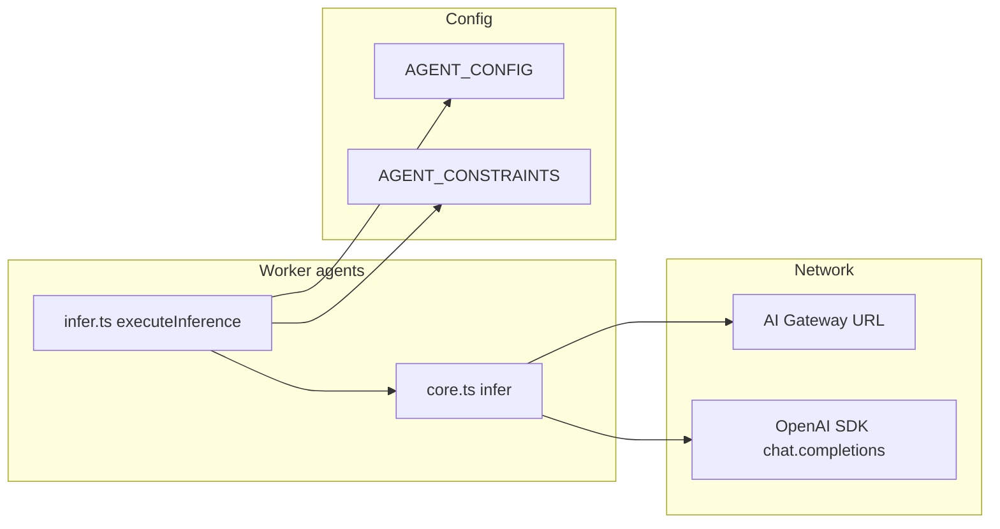

# LandiBuild v2.0.0 — AI engineering review (pre-release)

**Workspace:** `c:\Users\mikeh\Projects\landi\landibuild`  
**Scope:** Inference stack (`worker/agents/inferutils/`), agents (`codingAgent`, `realtimeCodeFixer`), model config / BYOK (`worker/api/controllers/modelConfig/`), registry (`config.types.ts`), constraints (`AGENT_CONSTRAINTS`), related frontend helpers.  
**Review date:** 2026-04-04  

---

## Executive summary

LandiBuild routes chat completions through an **OpenAI-compatible client** pointed at **Cloudflare AI Gateway** (`buildGatewayUrl`, `CLOUDFLARE_AI_GATEWAY` / `CLOUDFLARE_AI_GATEWAY_URL`), with optional **BYOK** keys merged at runtime (`InferenceRuntimeOverrides.userApiKeys`) and optional **user AI Gateway** override (`aiGatewayOverride`). **Workers AI** models use ids prefixed with `workers-ai/@cf/...`; gateway path normalization strips duplicate `/compat` and `/chat/completions` segments to avoid broken URLs.

**Strengths**

- **Gateway URL hardening** (`normalizeAiGatewayPathname` / `buildGatewayPathname`) reduces double-path failures when operators paste full compat URLs.
- **`nonReasoning` registry flag** gates `reasoning_effort` on the OpenAI request body, avoiding invalid combinations for marked Grok models.
- **Agent constraints** are centralized in `AGENT_CONSTRAINTS` and enforced consistently in **inference resolution** (`infer.ts` → `validateAgentConstraints`), **persistence** (`ModelConfigService.upsertUserModelConfig` → `throw`), and **read paths** (`applyConstraintsWithFallback`, `getFilteredModelsForAgent` for BYOK provider listing).
- **Abort** is forwarded via OpenAI client `signal: abortSignal` (`core.ts` `chat.completions.create`).
- **BYOK** keys are loaded from the user vault without writing them into Durable Object state (`InferenceContext` documents runtime-only overrides); `getApiKey` prefers runtime vault-backed keys when valid.

**Main risks**

- **Unknown or unregistered model ids** can yield **`undefined` `AIModelConfig`** and crash inside `getConfigurationForModel` (property access on `undefined`).
- **`validateModelAccessForEnvironment`** is **not aligned** with how **`getApiKey`** falls back to the **platform AI Gateway token** for many providers (e.g. Grok): UI may **403** model saves that would still **infer** in production.
- **`AIModels.DISABLED` (`disabled`)** maps to synthetic provider **`cloudflare`** in `getProviderFromModel`, so BYOK/platform checks can **block saving** “disabled” as a user-visible model choice.
- **`RealtimeCodeFixer` full-rewrite path** instructs the model to use **commented** `//<content>` tags, but extraction uses a regex for **raw** `<content>...</content>`, so rewrites may **not apply** reliably.
- **`executeInference` “cheaper model” retry** hard-codes **`GEMINI_2_5_FLASH`**, bypassing per-agent **`resolveModelConfig` / constraints** for that retry leg.

**Gate verdict: PASS_WITH_FIXES** — acceptable for an explicit **pre-release** only if the **CRITICAL** / **HIGH** items below are tracked and scheduled; treat **unknown-model crash** and **config-vs-runtime access mismatch** as **ship blockers** for a GA confidence bar.

---

## Architecture (inference path)

1. **`resolveModelConfig`** (`infer.ts`): merges user `InferenceContext.userModelConfigs[action]` with `AGENT_CONFIG`, validates chat modality and **constraints**.
2. **`infer`** (`core.ts`): rate limits, optional image-model rejection, **`getConfigurationForModel`**, OpenAI call with **`reasoning_effort`** omitted when `nonReasoning`, **`abortSignal`** passed through.
3. **`executeInference`**: retries with exponential backoff; on some `InferError` paths switches to a **hard-coded** cheaper model; on other errors switches to **`fallbackModel`**.

---

## 1. `AGENT_CONSTRAINTS` completeness (`config.ts` + `constraintHelper.ts`)

### 1.1 `AgentActionKey` coverage

`AgentConfig` keys (from `config.types.ts`):  
`templateSelection`, `blueprint`, `projectSetup`, `phaseGeneration`, `phaseImplementation`, `firstPhaseImplementation`, `fileRegeneration`, `screenshotAnalysis`, `realtimeCodeFixer`, `fastCodeFixer`, `conversationalResponse`, `deepDebugger`, `agenticProjectBuilder`.

| `AgentActionKey`           | In `AGENT_CONSTRAINTS`? | Notes |
|----------------------------|-------------------------|--------|
| `fastCodeFixer`            | Yes                     | `REALTIME_FAST_FIXER_ALLOWED` |
| `realtimeCodeFixer`        | Yes                     | Same set |
| `fileRegeneration`         | Yes                     | `new Set(AllModels)` |
| `phaseGeneration`          | Yes                     | `AllModels` |
| `projectSetup`             | Yes                     | `AllModels` |
| `conversationalResponse`   | Yes                     | `AllModels` |
| `templateSelection`        | Yes                     | `AllModels` |
| `blueprint`                | **No**                  | `validateAgentConstraints` → **no constraint** → always valid |
| `firstPhaseImplementation` | **No**                  | Same |
| `phaseImplementation`      | **No**                  | Same |
| `screenshotAnalysis`       | **No**                  | Same |
| `deepDebugger`             | **No**                  | Same |
| `agenticProjectBuilder`    | **No**                  | Same |

**Assessment:** By design, missing map entries mean **no narrowing** (`constraintHelper`: “graceful default”). This is **consistent** but means **heavy agents** (implementation, debugger, blueprint) rely on **DB upsert validation** only where `validateModel` runs — and **not** on a constraint map entry. If product intent is to cap **e.g. deep debugger** to a subset, **`AGENT_CONSTRAINTS` is incomplete**.

### 1.2 `enabled` flag

Every defined constraint has **`enabled: true`**. `validateAgentConstraints` treats missing or disabled constraints as **unrestricted**. There is **no** live code path that toggles `enabled` per deployment; it is **structural only** today.

### 1.3 `allowedModels` vs registry

- **`REALTIME_FAST_FIXER_ALLOWED`**: Workers AI subset + `DISABLED` + selected Grok/Gemini models; **excludes** e.g. **Nemotron 120B**, **Anthropic**, **OpenAI**, **Vertex** — appropriate for **latency-sensitive** fixers **if** that is the product rule.
- **`AllModels`** arms **chat-only** ids (image rows excluded via `isChatModalityConfig`), so **FLUX / Leonardo** are not in `AllModels`.

**Gap:** If a new **chat** model is added to `MODELS_MASTER` but **not** added to `REALTIME_FAST_FIXER_ALLOWED`, users **cannot** assign it to `realtimeCodeFixer` / `fastCodeFixer` even when latency is acceptable — **operational maintenance burden**.

---

## 2. Model registry (`config.types.ts`)

### 2.1 Id format sanity

| Model / family | Id pattern | Assessment |
|----------------|------------|------------|
| Workers AI chat | `workers-ai/@cf/...` | Aligns with repo comment and gateway expectations |
| Gemini | `google-ai-studio/gemini-...` | Consistent |
| OpenAI | `openai/gpt-5...` | Consistent |
| Anthropic | `anthropic/claude-...` | Consistent |
| Grok | `grok/grok-...` | Consistent with `getProviderFromModel` → `grok` |
| Vertex | `google-vertex-ai/...` | Consistent |

### 2.2 Accuracy / consistency flags

| Item | Severity | Detail |
|------|----------|--------|
| `KIMI_2_5` under `// --- Google Models ---` | LOW | Misleading section comment; model is **Moonshot on Workers AI** |
| `KIMI_2_5` `contextSize: 256000` vs comment “1M Context” | MEDIUM | Comment contradicts numeric field |
| `GROK_4_1_FAST` `nonReasoning: true` but id contains `...-reasoning` | LOW | Likely **provider naming** vs capability; verify against gateway catalog |
| `QWEN_3_CODER_480B` comment vs `creditCost: 8` | LOW | Comment text does not match credit value |

### 2.3 `nonReasoning`

Grok entries marked `nonReasoning: true` match the intent to **omit** `reasoning_effort` in `infer` (`core.ts`). Models without the flag still receive `reasoning_effort` when provided.

### 2.4 `DISABLED`

- Registered as id `disabled`, provider `None`, `contextSize: 0`.
- **`isChatCompletionAIModel`**: unknown / non-registry strings are treated as chat-capable; **`disabled`** is in `AI_MODEL_CONFIG` as chat modality → **chat-capable**.
- **Risk:** Provider/access checks (below) do not treat **`disabled`** as a special sentinel for “no API calls”.

### 2.5 `AllModels` completeness

`WORKERS_NEMOTRON_3_120B` is chat and **is** in `AllModels`. Image models are **excluded** by design. No obvious **missing chat** enum vs `MODELS_MASTER` from static review.

---

## 3. Inference core (`core.ts`, `infer.ts`)

| Topic | Finding | Severity |
|-------|---------|----------|
| **Missing `AIModelConfig`** | `const modelConfig = AI_MODEL_CONFIG[modelName as AIModels]` can be **`undefined`**; `getConfigurationForModel(modelConfig, ...)` then **throws** on `modelConfig.directOverride` | **CRITICAL** |
| **Fallback model** | `executeInference` uses `resolvedConfig.fallbackModel` on generic errors; does **not** validate fallback against constraints again at switch time (already validated in `resolveModelConfig`) — OK | — |
| **“Cheaper model” path** | Forces **`AIModels.GEMINI_2_5_FLASH`** without `validateAgentConstraints` / user access checks | **HIGH** (constraint + BYOK edge cases) |
| **BYOK injection** | Runtime keys merged in `getApiKey`; not logged as full strings in reviewed path | OK |
| **Gateway token in headers** | `cf-aig-authorization` when `apiKey !== gatewayToken` | Intended for gateway “wholesaling” |
| **`getApiKey` logging** | Logs provider name (not key) | OK |
| **Abort** | `signal: abortSignal` passed to SDK | OK |
| **Empty response** | Non-stream, no tools: logs warning, returns `{ string: "" }` | **MEDIUM** — callers may treat as success |
| **Rate limits** | `RateLimitService.enforceLLMCallsRateLimit` before call | OK |
| **`ToolDefinition<any, any>`** | Present in `InferArgsBase` | **LOW** vs AGENTS.md “no any” policy |
| **Claude thinking** | `extra_body.thinking.budget_tokens` uses `reasoning_effort ?? 'medium'`; `minimal` exists in map | OK |

---

## 4. `RealtimeCodeFixer` (`realtimeCodeFixer.ts`)

| Topic | Finding | Severity |
|-------|---------|----------|
| **Error handling** | Outer `run` catches errors and returns original file — **safe** | OK |
| **`executeInference` null** | Returns original file | OK |
| **`<content>` rewrite** | Prompt asks for `//<content>` … `//</content>`; code matches `<content>([\s\S]*?)</content>` **without** comment syntax | **HIGH** — rewrite path likely **broken** when model follows instructions |
| **`getLLMCorrectedDiff`** | Uses **`infer`** directly with **`AGENT_CONFIG.realtimeCodeFixer.name`**, **not** `executeInference` / user merged config — **inconsistent** with main pass | **MEDIUM** |
| **Logging** | `failedBlocksText` / diffs can contain **user code** in logs | **MEDIUM** (privacy / log volume) |
| **`IsRealtimeCodeFixerEnabled`** | Uses `console.log` | **LOW** |
| **Race / WebSocket** | Fixer is **async file pipeline**, not WS-bound; no new race beyond parent agent concurrency | — |

---

## 5. `CodingAgent` (`codingAgent.ts`)

Reviewed **structure and integration** (full file partially read): class **orchestrates** behaviors, WebSocket tickets, state migration, and delegates generation to **behaviors** / **operations** that call **`executeInference`**. No **inherent infinite loop** in this file; tool depth limits live in **`getMaxToolCallingDepth`** (`constants.ts`) and **`infer`** recursion. **Deep debugger** depth **40**, **agentic** **100** — high caps; rely on **completion detectors** and **abort** for safety.

---

## 6. BYOK helper (`byokHelper.ts`)

| Topic | Finding | Severity |
|-------|---------|----------|
| **Key validation** | `looksLikeApiKey` / `isValidPlatformApiKey` reject short / `none` / `default` | OK |
| **Vault errors** | Catch + log, return partial / conservative status | OK |
| **`workers-ai` → `workers`** | `getAccessProviderFromModelId` maps prefix to **`workers`** for env / BYOK alignment | OK |
| **Platform providers** | Auto-detect lists `anthropic`, `openai`, `google-ai-studio`, `cerebras`, `groq`, plus **`workers`** if `WORKERS_API_KEY` | **HIGH** — **no `grok`**, **no `google-vertex-ai`** |
| **BYOK templates** (`secretsTemplates.ts`) | No **Grok** / **Vertex**-specific BYOK template in reviewed templates | Aligns with **access check gaps** for those providers |

---

## 7. Model config controller (`controller.ts`) + service (`ModelConfigService.ts`)

| Topic | Finding | Severity |
|-------|---------|----------|
| **Constraint enforcement on write** | `upsertUserModelConfig` → `validateModel(..., 'throw')` | OK |
| **Access enforcement** | `validateModelAccessForEnvironment` before upsert | **HIGH** — mismatches **gateway-token-only** inference for some providers |
| **`DISABLED` save** | `getAccessProviderFromModelId('disabled')` → **`cloudflare`**; unlikely to satisfy platform/user key checks | **HIGH** |
| **Update API** | Requires **`modelName`** even for partial updates (`if (!modelConfig.name) return 400`) | **MEDIUM** — API ergonomics |
| **`reasoningEffort` schema** | Zod omits **`minimal`**; service maps `minimal` to `null` on persist | OK for stored rows |
| **`getModelConfigsInfo`** | Exposes `config.description`; **`ModelConfig`** has no `description` field — value will be **`undefined`** unless types are widened elsewhere | **LOW** |

---

## 8. Issue list (consolidated)

| ID | Severity | Location | Description | Recommendation |
|----|----------|----------|-------------|----------------|
| I1 | **CRITICAL** | `core.ts` ~601–616 | `AI_MODEL_CONFIG[modelName]` may be **undefined**; passed into `getConfigurationForModel` → runtime throw | Guard: if missing config, derive provider from id string **or** reject with **`InferError`** before calling `getConfigurationForModel` |
| I2 | **HIGH** | `byokHelper.ts` + `controller.ts` | **`validateModelAccessForEnvironment`** does not model **AI Gateway unified** access (fallback to `CLOUDFLARE_AI_GATEWAY_TOKEN` in `getApiKey`) | Add explicit rule: if platform gateway token valid, allow save **or** align `getPlatformEnabledProviders` with real inference policy |
| I3 | **HIGH** | `byokHelper.ts` `getProviderFromModel` / `controller.ts` | **`disabled`** maps to **`cloudflare`**; blocks legitimate “turn off feature” model selection in API | Special-case **`AIModels.DISABLED`** in access validation (always allowed) |
| I4 | **HIGH** | `infer.ts` ~193–220 | Retry uses **hard-coded** `GEMINI_2_5_FLASH` without constraint / access checks | Use **`resolveModelConfig`** fallback chain, or **`GEMINI_2_5_FLASH` only if** `validateAgentConstraints` and `validateModelAccess` pass |
| I5 | **HIGH** | `realtimeCodeFixer.ts` ~298–305 | **`<content>`** extraction inconsistent with **commented** tag instructions | Normalize regex to accept optional `//` prefixes **or** change prompt to **uncommented** tags |
| I6 | **MEDIUM** | `realtimeCodeFixer.ts` ~487–496 | Diff correction uses raw **`infer`** + **`AGENT_CONFIG`** defaults, ignoring user model config | Pass **`executeInference`** or thread **`userModelConfigs`** / same `agentActionName` resolution |
| I7 | **MEDIUM** | `core.ts` / `ModelTestService.ts` | Empty model output returns **success** with empty string in some paths | Surface **failure** or **ambiguous** result to UI for model tests |
| I8 | **MEDIUM** | `realtimeCodeFixer.ts` logging | Code / diff content in logs | Redact or log hashes only in production |
| I9 | **LOW** | `config.types.ts` | Misleading **comments** (Kimi under Google header; context comment) | Fix comments to match **Moonshot / Workers** and **numeric context** |
| I10 | **LOW** | `core.ts` | Verbose **`[TOOL_CALL_DEBUG]`** logging | Gate behind debug flag |
| I11 | **LOW** | `infer.ts` / `core.ts` | `ToolDefinition<any, any>` | Replace with **unknown** or generic tool typing per project standards |

---

## 9. Self-review (reviewer checklist)

- [x] Read **`config.ts`**, **`config.types.ts`**, **`core.ts`**, **`infer.ts`**, **`realtimeCodeFixer.ts`**, **`byokHelper.ts`**, **`controller.ts`**, **`constraintHelper.ts`**, **`ModelConfigService.ts`**, **`ModelTestService.ts`**, **`deepDebuggerPrompts.ts`** (partial), **`model-helpers.ts`**, **`wrangler.jsonc`** (AI binding).
- [x] Cross-checked **`AGENT_CONSTRAINTS`** keys vs **`AgentConfig`** keys.
- [x] Traced **fallback**, **BYOK**, **gateway URL** construction, **abort**, **reasoning_effort** / **`nonReasoning`**.
- [x] Verified **`enabled`** semantics in **`constraintHelper`**.
- [x] Identified **runtime crash** path for **unknown model id** in **`infer`**.
- [x] Compared **model-config access validation** vs **`getApiKey`** fallback behavior.

---

## 10. Gate verdict

**PASS_WITH_FIXES**

Rationale: The inference architecture is **coherent** and **production-oriented** (gateway normalization, BYOK, rate limits, aborts, structured constraints). However, **I1** (undefined model config), **I2/I3** (access / disabled semantics), **I4** (hard-coded cheaper model), and **I5** (content rewrite mismatch) are **substantive** and should be **resolved or explicitly accepted** before treating v2.0.0 as **GA-ready**.
